# Building a Killer Experience with UI Builder

## Goal

In this lab you will learn how to use UI Builder to build and configure a front-end for a custom application. You will start with a prebuilt application for a recipe database where you can search, view, add and edit recipes. The application is seeded with recipes from both the author and ServiceNow developer community.

You will use UI Builder to open a start portal experience created from App Engine Studio to build a front-end to make it easier to interact with the application. This lab will touch on a number of different parts of UI Builder while you create the custom experience including but not limited to:

* Creating new pages
* Page parameters
* Data resources
* Client state parameters
* Client scripts
* Configuring components
* Using the new repeater component
* Using the new formula editor
* Updating ServiceNow records from the experience
* Theming and branding
* Building custom menus

## (Optional) Pre-flight check

If you're doing this lab during CreatorCon, you'll be working on an instance on NowLearning loaded with the Recipe DB application. If you're following along with this lab guide on a Personal Developer Instance (PDI), please follow the instructions in the Appendix at the end of this lab guide to learn how to pull in the Recipe DB application.

# Exercise 0 - Get Familiar with the Recipe DB App

## Goal

In your instance, you will find a Recipe DB app with a couple of tables loaded with data. Let's take a look.

1. In the top menu in your instance, click **All**, type *App Engine* into the filter, and click **App Engine Studio** to launch *App Engine Studio*, or *AES* as we'll call it moving forward.

    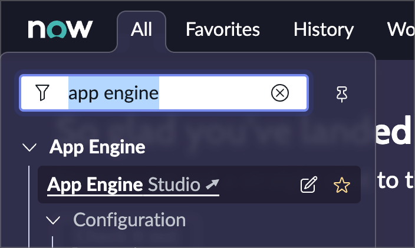

1. The app currently consists of:

    * Data (tables)
      * Category
      * Recipe
    * Experiences
      * Recipe DB (Portal experience)
      * New Recipe (Record producer)

# Exercise 1 – Build the Recipe Page

## Goal

In this exercise you will build a new page with a required parameter that displays a single recipe with an image, link button, and recipe information.

## Open UI Builder

1. From within App Engine Studio, in the *Experience* section, click the three horizontal dots icon at the very right-hand side of the *Recipe DB* experience and choose **Edit**.

	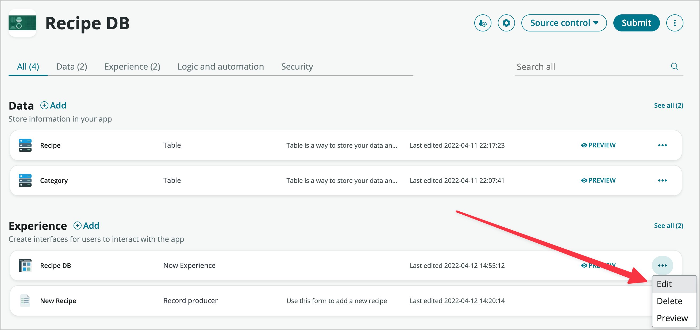

1. This will launch UI Builder (UIB) in a tab within App Engine Studio (AES). You can save some vertical real estate in AES/UIB by finding and clicking the *Enter full screen* icon at the very right hand side of the tab bar.

	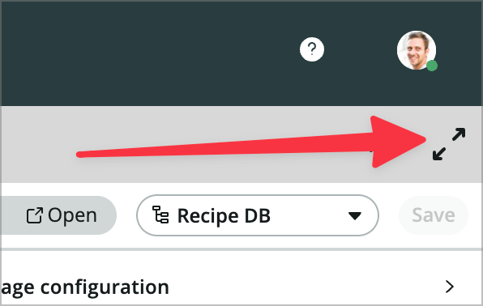

	> You can also use UIB outside of AES and you get an additional 50px of vertical screen real estate, but I prefer being able to easily get back to the home tab and look at my data model.

## Create the page

Now that you have UI Builder open you will need to create a new page to display your recipe.

1. Use the three vertical dots menu at the top of the page sidebar to choose **Create page** and launch the *Create a page* dialog.

	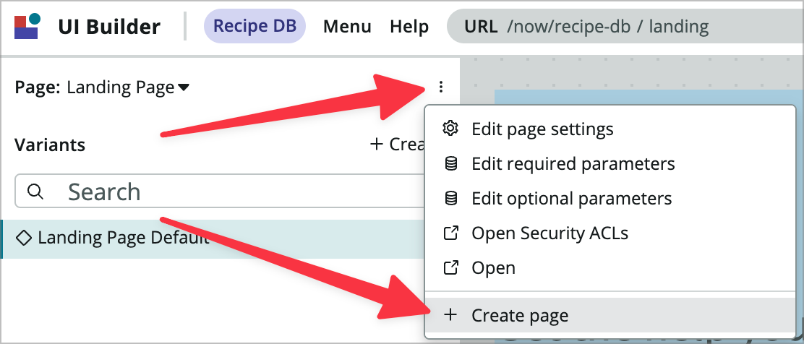

1. Name the page **Recipe** and choose **Create**.

1. In the success modal that appears choose **Add required parameters**.

1. Click the **+Add** button on the right side of the modal.

1. Enter **recipeId** as the name of the parameter

	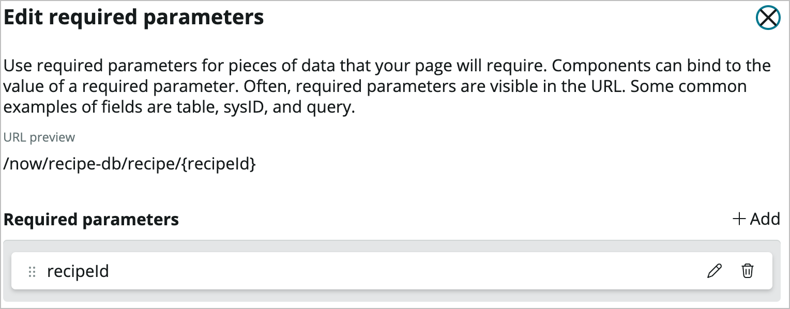

2. Click **Save** on the *Edit required parameters* modal.

3. Click **Done**.

## Add a Data Resource to the Page

1. The first thing you'll do on the new page is set a default value for the required parameter so you can see real data on the page. Click on **{{recipeId}}** in the URL box and paste **bf86d000113a89107f4444bd6579adb2** into the *recipeId* input field. If you can't copy/paste that sys_id you can grab any of the recipe sys_ids and use them.

2. Next, you'll add a data resource that uses the sys_id parameter. Click the data icon at the bottom left of the UI Builder window. 

	

1. Click the **+Add** icon to the right of *Data resource instances* to add a data resource to the page.

	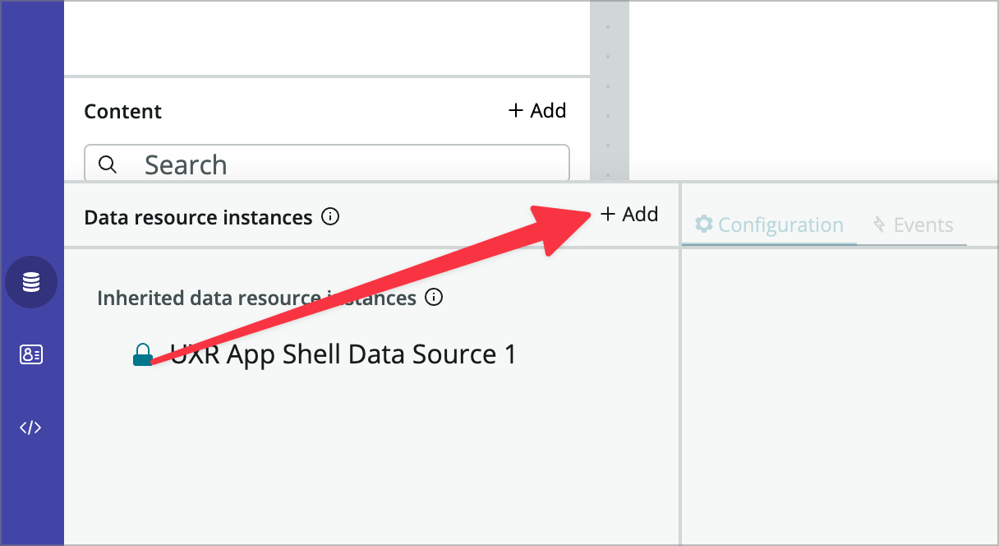

1. In the dialog that comes up, search for and select the **Look Up Record** data resource.

	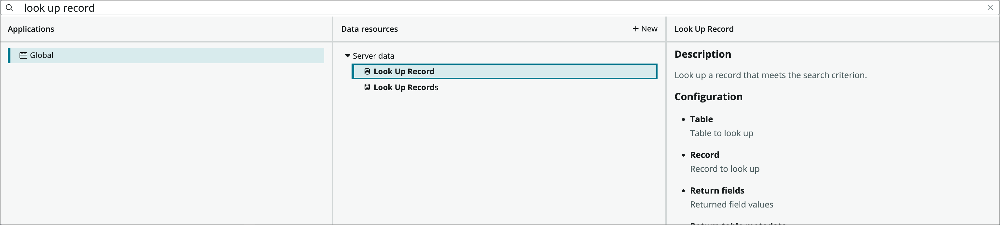

1. Scroll all the way down in the Look Up Record dialog box and click the **Add** button.

1. Now, you'll need to configure the data resource. Don't worry about the *something went wrong* message if that pops up. In the configuration panel, choose the i icon to the right of *Look up record*. 

	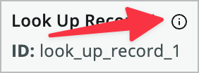

1. Change the label and name to:

	* *Data broker label*: **Look Up Recipe**
	* *Data broker ID*: **look_up_recipe**

1. Click **Apply**.

	> You can rename most data resources, components, containers, page scripts, etc. in UIB, but data resources are especially important to rename as you will probably end up with multiple on a page, and they are referenced by name in different places.

1. In the *Table* property select **Recipe [x_snc_recipe_db_recipe]**.

1. In the record property you're going to bind the recipe ID page parameter. Hover over the field and click the *Dynamic data binding* icon.

	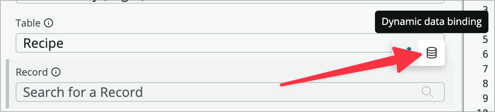

1. After toggling to data binding, enter **@context.props.recipeId**. This will bind the sys_id from the page's required parameters to the sys_id property on the data resource.

1. In the *Return fields* property add the following fields (one at a time, sorry) by clicking the **+Add** button, choosing the field, and clicking **OK**. Rinse and repeat:

	* Category
	* Directions
	* Favorite
	* Image
	* Information
	* Ingredients
	* Name
	* URL

	> You'll see that as you add fields you can see the data returned (and its structure, which is nice) in the data resource preview panel on the right.

2. Save the page using the **Save** button at the top right or with CMD/CTRL + S.

3. Close the data resource panel using the same icon you used to open it.

## Add Components to the Page Header

Now it's time to connect the data returned in your data resource to the components on the page. You'll be adding the components using the content panel on the left and configuring them with the configuration panel on the right. The middle of the page will show you a preview.

1. In the Content panel click **+ Add Component** under *Body (Flex)* and choose **Container**.

	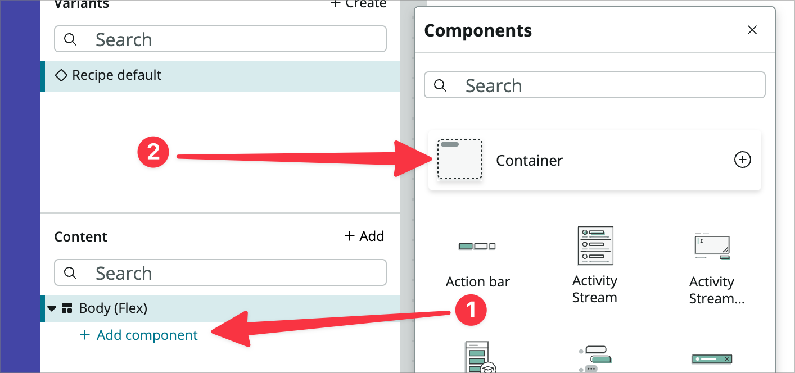

1. In the configuration panel on the right, choose the i icon to the right of *Container 1* and rename the container:

	* *Component label*: **Row 1**
	* *Component ID*: **row_1**

	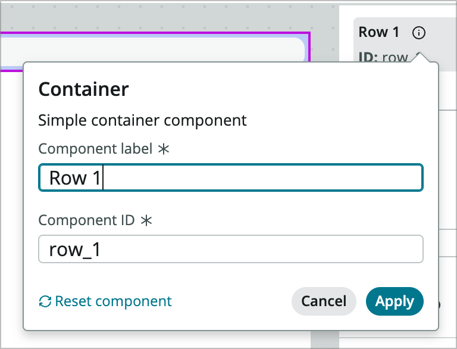

2. Click **Apply**.

3. In the *Styles* tab below where you renamed the container, set the following:

	* *Align items* (not alignment): **Center** (this will be the middlemost of the 5 icons)
	* *Background*: Click the + icon and choose **Primary 1**

1. Now, you'll add another container inside your Row 1 container by using the *Add component* link in the Content panel the same way you did the previous one.

1. You'll leave the name of this one alone and set the *Maximum width* property to **80rem**. Depending on the width of your display you may or may not see a difference at this point. This sets a maximum width so the contents will render nicely on a wide screen and not stretch the full page.

1. Inside of the new Container 1, choose **+ Add Component**.

1. Search for and choose the **Stylized text** component.

	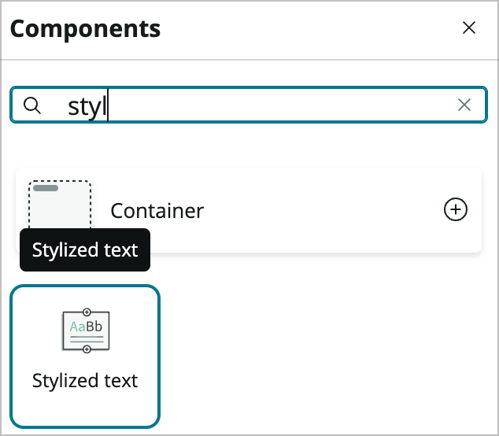

2. In the *Config* panel on the *Text* property, switch to Dynamic Data Binding and enter **@data.look_up_recipe.result.name.displayValue**. You should now see the name of the recipe appear in the preview pane.

3. In the CSS property still on the *Config* tab, click **Edit text CSS**.

	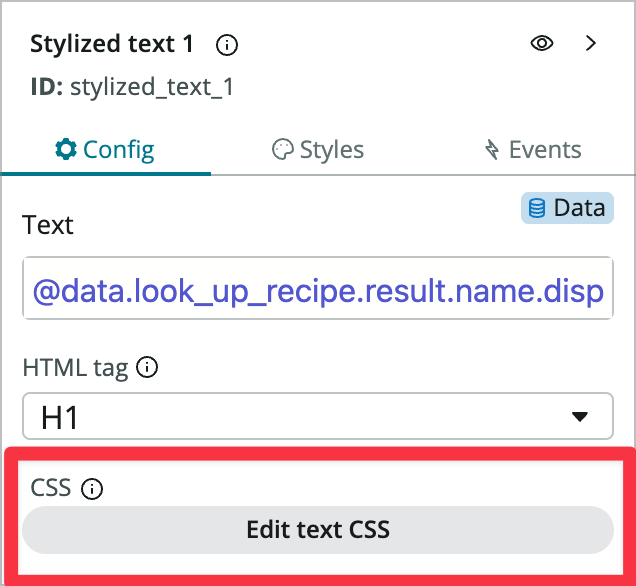

1. In the CSS Editor enter **{ color:white }** and click **Apply**.

## Add Components to the Page Body

1. Click on Row 1 in the content panel, then click on the three vertical dots to the right, choose **Add component after**, and add another container.

	

1. In the configuration panel on the right, choose the i icon to the right of Container 1 and rename the container to the following and **Apply**:

	* *Component label*: **Row 2**
	* *Component ID*: **row_2**

3. In the *Styles* tab below where you renamed the container, set the following:

	* *Align items* (not alignment): Center (this will be the middlemost of the 5 icons)
	* *Padding*: Click the + icon and choose **Lg (1rem)**
	* *Background*: Click the + icon and choose **Neutral 2**

1. Now add another container inside of your Row 2 container by using the *Add component* link in the Content panel the same way you did the previous one.

1. You'll leave the name of this one alone and set the *Maximum width* property to **80rem**. Depending on the width of your display you may or may not see a difference at this point.

1. Inside of that *Container 2*, add another container. 

1. Set the following styles for the new *Container 3*:

	* *Type*: **Grid**
	* *Spacing*: **Xxs (0.125rem)**
	* *Columns*: **3**
	* *Rows*: **1**

	> This container is using the new [CSS grid layout](https://docs.servicenow.com/bundle/sandiego-application-development/page/administer/ui-builder/concept/css-grid-uib.html) introduced in the San Diego release.

1. Next add another container inside the Grid container you just configured. You should have 4 nested containers starting with Row 2.

	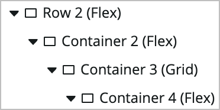

2. Inside the newest *Container 4* container add a new component and select the **Image** component.

3. Configure its properties as follows:

	* *Image source*: switch to dynamic data binding and enter **@data.look_up_recipe.result.image.displayValue**
	* *Fit*: **Stretch to fit**
	* *Position*: **Top-Left**

1. Add another container after *Container 4* by clicking on **Container 4**, clicking the 3 vertical dots icon, choosing **Add component after** and clicking **Container**. You'll see how it appears next to the image in the grid layout.

	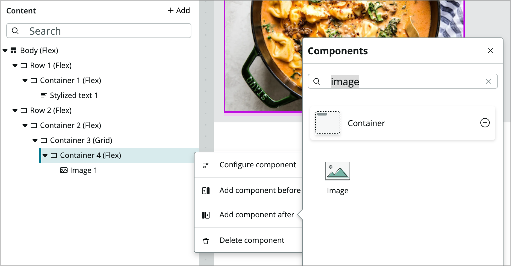

1. In the new Container 5 set the *Margin* property to **Lg (1rem)**.

1. Add a **Stylized text** component within the Container 5 and set the following properties:

	* *Text*: **Ingredients**
	* *HTML Tag*: **H2**

2. Search for and add a **Rich text** component after the stylized text component.

	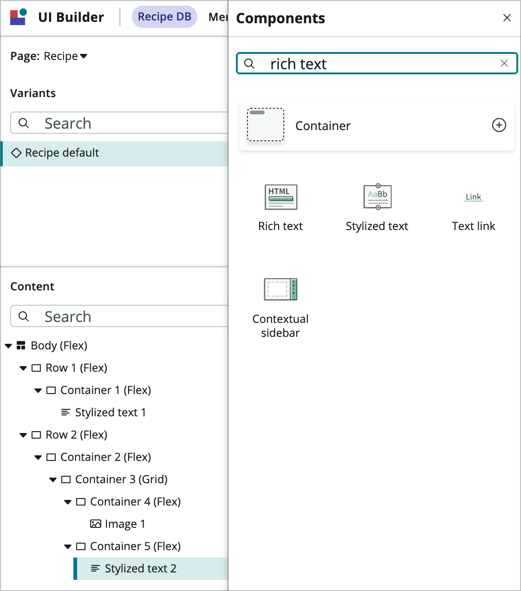

1. Mouse over the Edit html button (which is a property) and toggle to dynamic data binding.

	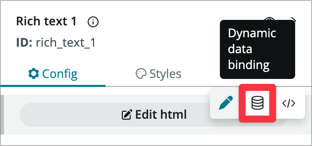

1. Set the value of the *HTML* property to **@data.look_up_recipe.result.ingredients.value**.

1. Now you'll add the third container to the grid. Add another container after this most recent container 5 and set the *Margin* to **Lg (1rem)**.

1. Similar to the previous component, inside the new container add a stylized text component with the following properties:

	* *Text*: **Recipe Info**
	* *HTML Tag*: **H2**

1. After that stylized text, add a rich text component, switch to dynamic data binding for the HTML property and enter **@data.look_up_recipe.result.information.value**.

	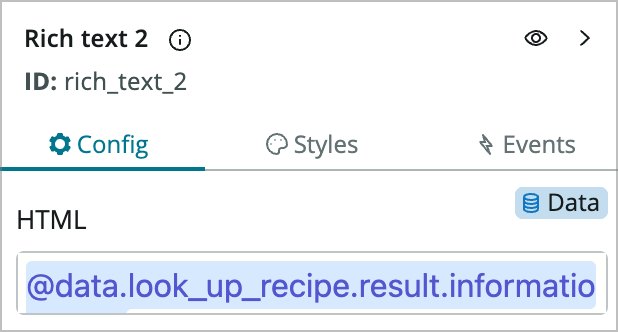

2. Now you'll add a container below the grid container that will show the recipe instructions. Click on **Container 3**, click the 3 vertical dots, click **Add component after**, and choose **Container**.

	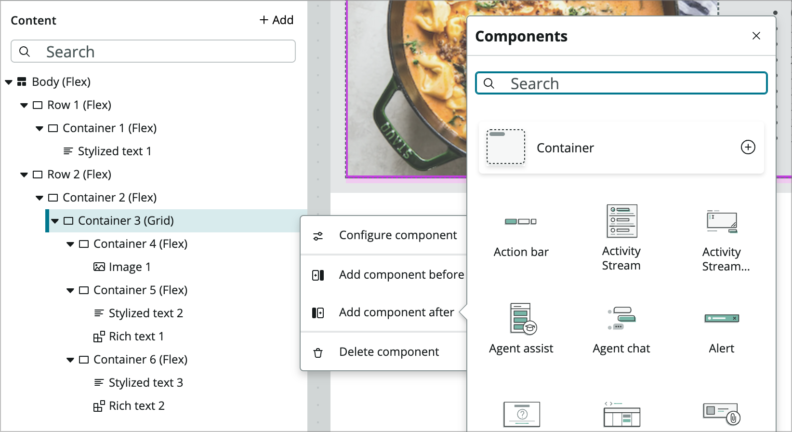

1. Now add another *Stylized text* component within that container and configure the following properties:

	* **Text**: *Directions*
	* **HTML tag**: *H2*

1. Now add a *Rich text* component after the *Stylized text* component.

1. After that stylized text, add a rich text component, switch to dynamic data binding for the HTML property and enter **@data.look_up_recipe.result.directions.value**.

	At this point, your page should look something like this.

	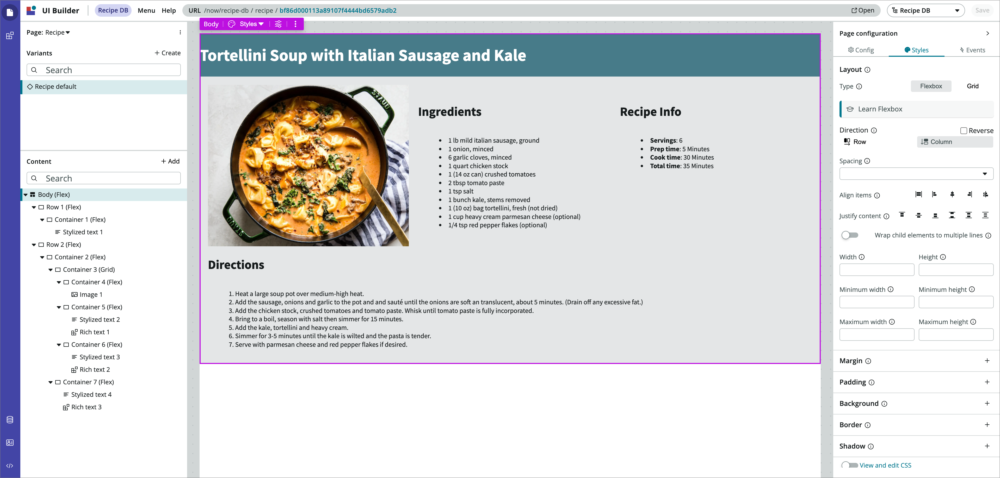

2. **Save** your page and use the **Open** link to preview the page in the runtime. 

Notice that your page also has a header and footer that is added when it is rendered in the runtime. You'll be updating some of that in exercise 3. Now you'll move on and create a home page for your app.

# Exercise 2 – Build the Home Page

## Goal

In this exercise you will build a homepage using the repeater component to show a list of recipes with a button that opens the recipe page you created in exercise 1.

## Create the page

1. From within UI Builder, create a page by clicking on the three vertical dots icon to the right of your current page name (which is *Recipe* if you're following directly from exercise 1) and clicking **+ Create Page**.

1. Name your page **Home** and click **Create**.

1. This page won't take any parameters so just click **Done** in the dialog.

## Add a Data Resource

1. Next you'll add a data resource that will fetch the recipes marked as favorites. Click the data icon at the bottom left of the UI Builder window. 

	

1. Click the **+Add** icon to the right of *Data resource instances* to add a data resource to the page.

	

1. In the dialog that comes up search for and select the **Look up Records** data resource and click **Add**.

	> ATTENTION! Make sure you select the **Look up Records** with an 's' and NOT the *Look up Record* singular data resource as they'll behave differently.

2. In the Data Resource *Configuration* panel click the i icon and rename the data resource to:

	* *Data broker label*: **Look Up Favorites**
	* *Data broker ID*: **look_up_favorites**

	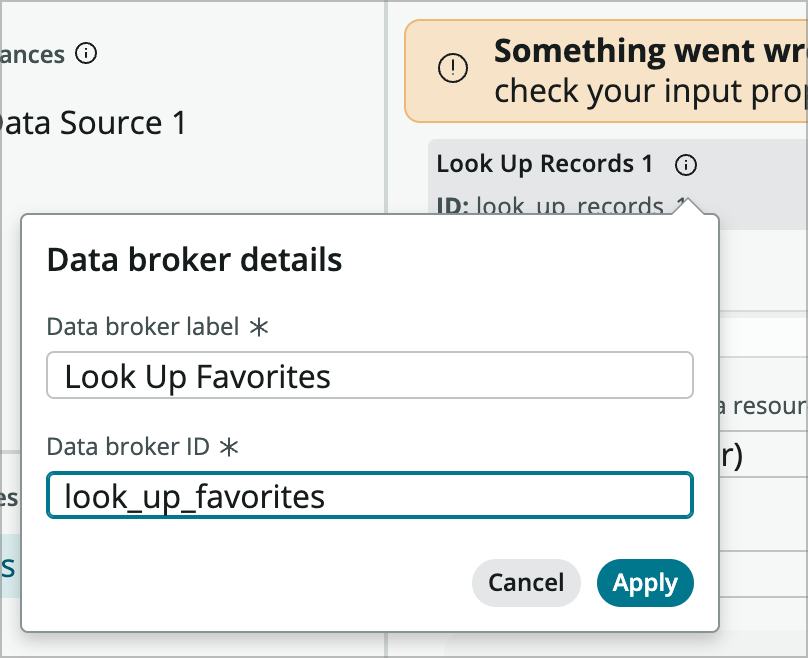

1. Click apply and make sure your data resource is renamed.

1. Configure the data resource properties as follows:

	* *Table*: **Recipe**
	* *Edit conditions*: **\[Favorite\] \[is\] \[true\]**
	* *Return fields*: **\[Name\] \[Image\] \[Sys ID\]**

1. **Save** the page and collapse the Data resource panel.

## Add a header

1. For this page we'll use two Rows like the previous one. In the content panel click **+ Add component** and add a **Container**.

1. In the configuration panel on the right, choose the i icon to the right of *Container 1* and rename the container:

	* *Component label*: **Row 1**
	* *Component ID*: **row_1**

1. Choose **Apply**.

2. In the styles panel for your Row 1 container configure the following properties:

	* *Align items*: Centered
	* *Padding*: **Lg (1rem)**
	* *Background*: **Primary 1**

1. Now add another Container within *Row 1*.

1. Configure the *Styles* panel by setting the *Maximum width* to **80rem**.

1. Within that container, add a **Stylized Text** component and configure its Config properties:

	* *Text*: **My Recipe DB**
	* *HTML Tag*: **H1**
	* *CSS*: \<Edit text CSS\> and enter **{ color:white }** and click **Apply**.

1. Go ahead and save the page at this point.

## Build the Page Body

1. Now add another component after your Row 1 component.

	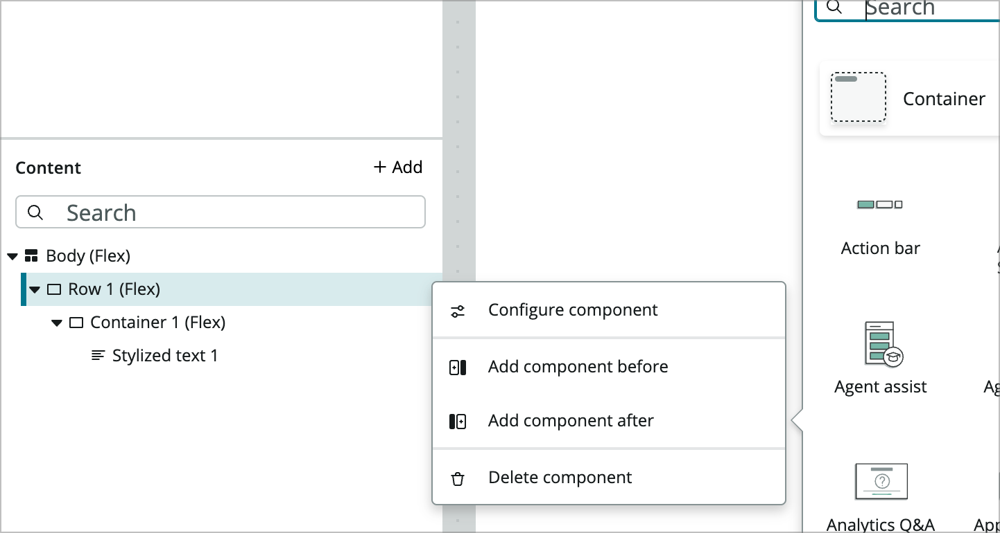

2. In the configuration panel on the right, choose the i icon to the right of Container 2, rename the container to the following, and **Apply**:

	* *Component label*: **Row 2**
	* *Component ID*: **row_2**

3. In the *Styles* tab below where you renamed the container, set the following:

	* *Align items* (not alignment): Center (this will be the middlemost of the 5 icons)
	* *Background*: Click the + icon and choose **Neutral 2**

1. Now add another container within Row 2 and configure its styles:

	* *Maximum width*: **80rem**
	* *Margin*: Click the plus and then change the dropdown to **Use CSS Custom Value**. Click the three horizontal dots to the right and set *Bottom* to **3xl (2.5rem)**

1. Add another container inside that one and change the *Direction* property from *Column* to **Row**.

1. Add a **Stylized Text** component within that container and set its properties:

	* *Text*: **My Recipes**
	* *HTML tag*: **H3**

	Your content tree should now look something like:

	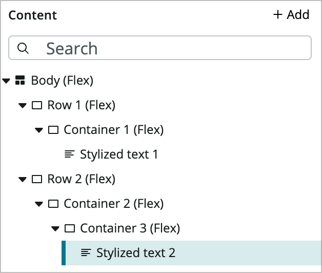

1. Now you'll add another component after *Container 3* called a **Repeater**. Make sure you do this after and not within Container 3.

	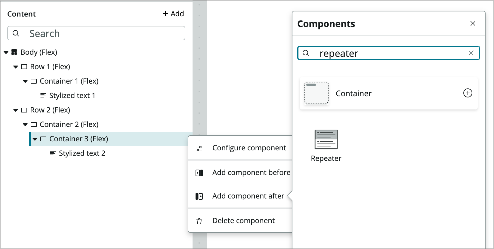

	> The repeater component is basically a container that lets you iterate, or repeat, through a set of data in the form of an array. 

1. In the *Config* tab of the repeater component, use the **Dynamic Data Binding** icon to switch to binding on the *Data array* property.

	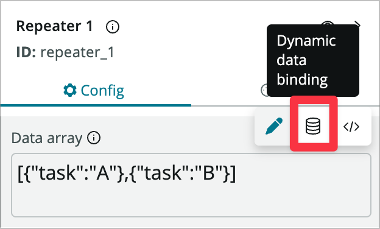

1. Enter **@data.look_up_favorites.results** and after a couple of seconds you should see the repeater component in the content tree updated with an icon showing the number of results returned by the data resource.

	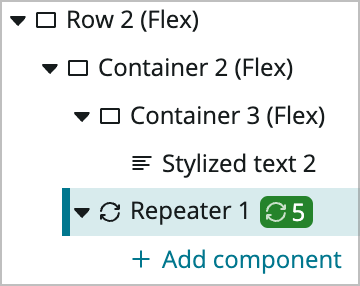

1. Click into the *Styles* tab on the configuration panel and click the **Enable styles** link. This allows the repeater to act like a container as well, which simplifies things for us.

1. Configure the repeater styles as follows:

	* *Type*: **Grid**
	* *Spacing*: **Lg (1rem)**
	* *Columns*: **4**
	* *Rows*: **1**

2. Within the repeater add a **Container** component.

	> You will notice that even though the repeater has 5 items, only the first element of the grid has a container. The repeater component does this on purpose to help out with page performance within UI Builder. When the page is rendered in runtime it will show all 5 elements.

1. Configure the *Container* as follows:

	* *Margin*: **Lg (1rem)**
	* *Background*: **Primary 0**
	* *Border*:
    	* *Thickness*: **Xxs (0.125rem)** (this didn't change)
    	* *Type*: **solid** (this didn't change)
    	* *Color*: **Primary 1**
    	* *Radius*: **Lg (0.5rem)**
  	* *Shadow*: Click the plus icon and leave the **Md** value

	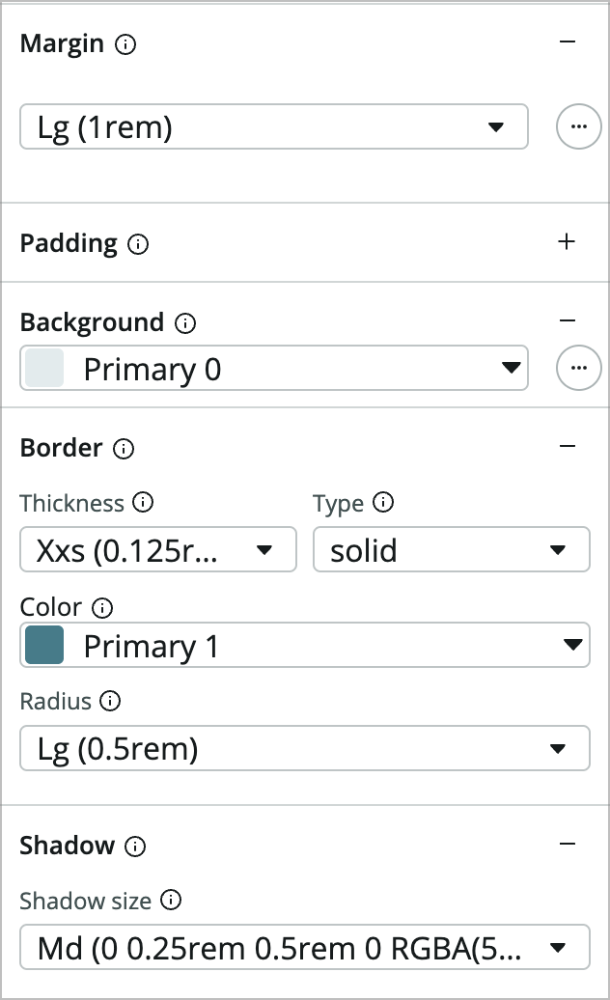

2. Inside the new *Container 4* add a **Stylized text** component.

1. Configure its properties as follows:

	* *Text*: \<switch to dynamic data binding\> **@item.value.name.value**
	* *HTML tag*: **H3**

	You may have noticed that @item.value.name.value is a different data binding than you've used so far. This is specific to the repeater component where item.value refers to the element in the repeater. You may also notice that the data binding within the repeater component doesn't always autocomplete. That's why you're copying and pasting in the his lab.

	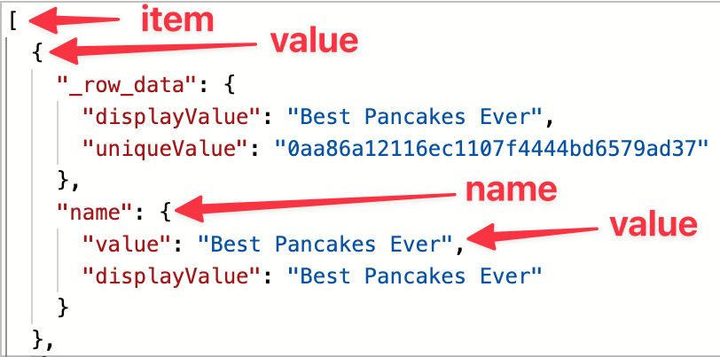

1. After the Stylized text component, add an **Image** component.

1. Set the *Image source* property to dynamic data binding and set its value to **@item.value.image.displayValue**.

1. After the *Image* component, add a **Button** component and set its *Config* properties.

	* *Size*: **Large**
	* *Label*: **Open**

1. In the *Styles* tab click the plus on *Margin*, set it to **Use Custom CSS Value**, click the three horizontal dots and set *Top* to **Lg (1rem)**.

1. Now that the button is styled you need to make it do something. Click the *Events* tab on the button configuration.

1. Under the *Button clicked* click the **Add a new event handler** link.

	

1. Choose the **Link to destination** *Inherited event handler* and then click **Select destination**.

	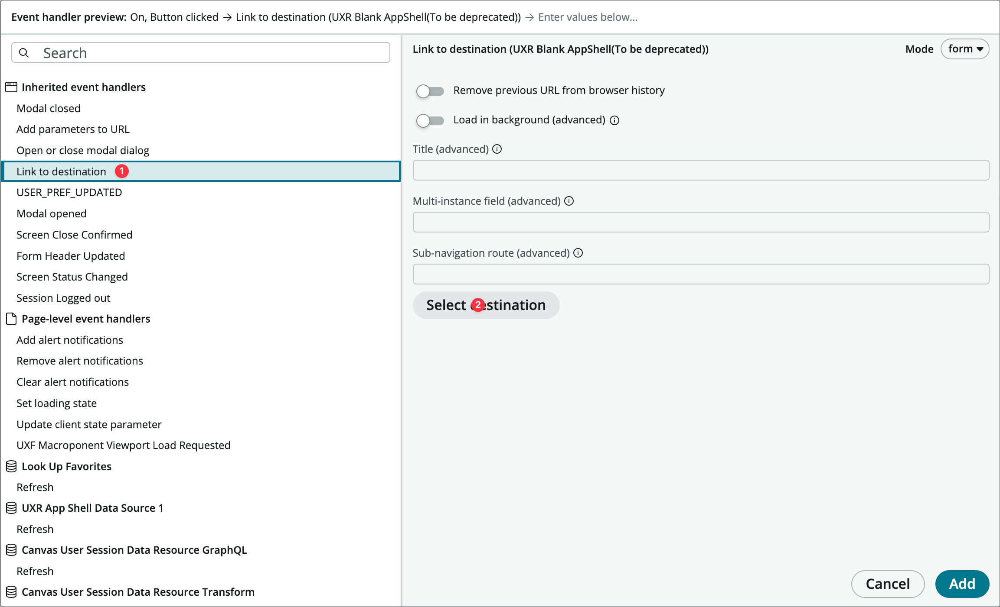

1. In the *Configure navigation* model choose **App routes > Recipe**.

2. In the *recipeId* field that comes up, switch to dynamic data binding, enter **@item.value.sys_id.value**, and click **OK**.

	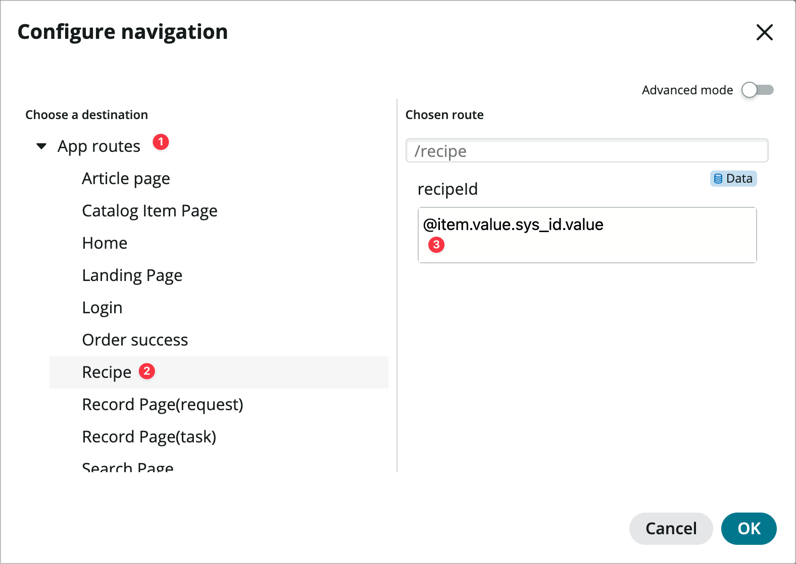

1. Click **Add**.

1. **Save** the page and open it in runtime. You should see multiple recipes that you can click into.

## Add Favorites Filtering

Now you'll add a checkbox where you can show only favorites or all recipes in the repeater component.

1. Back in UI Builder, click the *Client State Parameters* icon (the one below the data icon you have used) to open the CSP panel.

	

	> You can think of client state parameters as the page's scratchpad where you can define variables and then assign values from event handlers or page scripts.

1. Click **Add** and fill out as follows:

	* *Name*: **favoritesOnly**
	* *Type*: **Boolean**
	* *Initial value*: **true**

	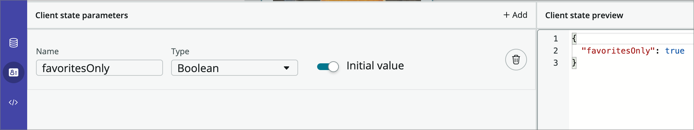

1. Collapse the client state parameters panel.

1. Now add a **Checkbox** component after the *Stylized text 2* component (the one that says My Recipes).

	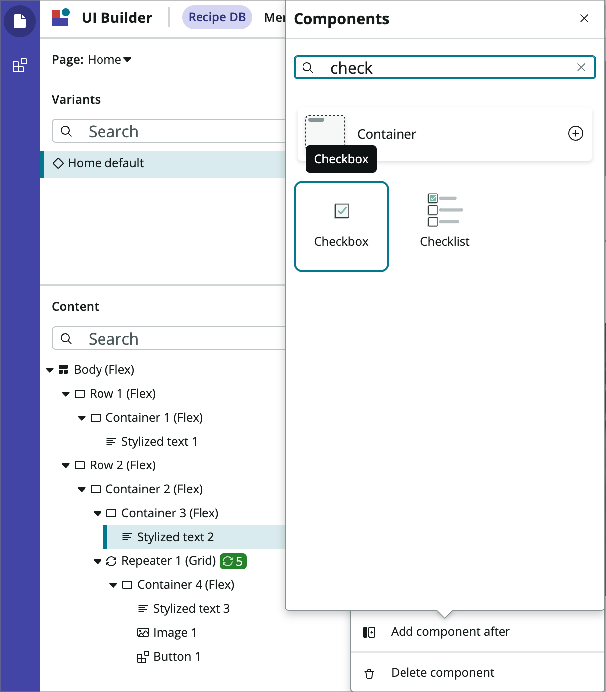

1. Set its *Config* properties as follows:

	* *Label*: **Favorites only**
	* *Checked*: **true**

1. In the *Styles* tab set the *Margin* to **Lg (1rem)**.

1. In the *Events* tab choose **Add a new event handler** under the *Checkbox checked set* event.

1. Choose the **Update client state parameter** *Page level event handler* and fill in his properties as follows:

	* *Client State Parameter Name*: **favoritesOnly**
	* *New value*: \<toggle to dynamic data binding\> and enter **@payload.value**

1. Click **Add**.

1. Now use the **Add a new event handler** under the *Checkbox checked set* event to add another event handler to that event. This will set the parameter and then refresh the data resource so it uses the new parameter value.

2. Choose the **Refresh** event handler under *Look up favorites* and click **Add**.

	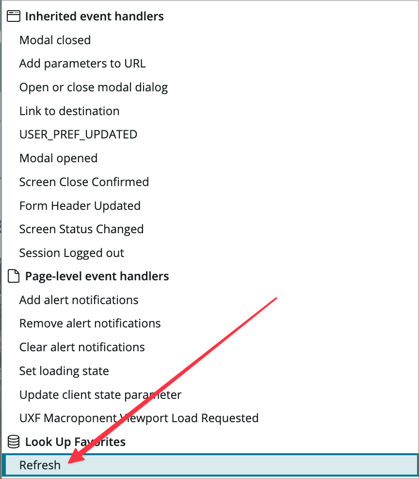

1. Now use the **Data** icon to open the *Data resource instances* panel.

1. Click into the **Look up Favorites** data resource and click the **Edit conditions** property.

	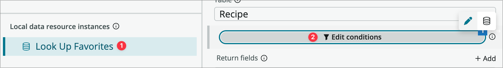

1. Hit the **Or** button and add **[Favorite] [is] [@state.favoritesOnly]** (make sure to switch to dynamic data binding) and click **Apply**.

	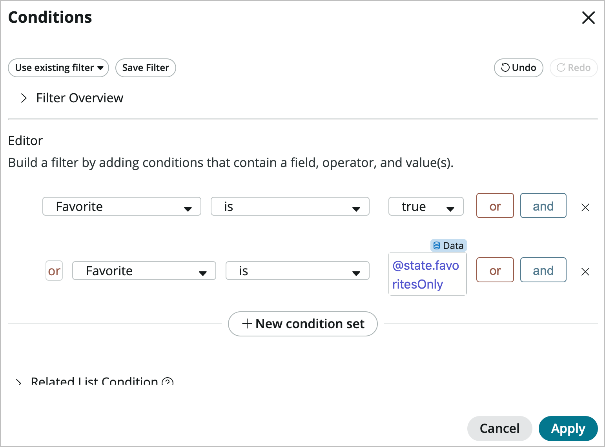

1. Close the *Data resource instances* panel, **Save** the page, and open it in the runtime. You should be able to uncheck and check the *Favorites only* checkbox and see more recipes on the page.

# Exercise 3 – Theming and Menus

## Goal

In this exercise you will upload a new logo, change the colors, add a header menu, and edit some other header settings.

## Branding and Theming

First, you'll change the logo and colors.

1. From within UI Builder near the top of the UIB window, go to **Menu > Edit experience settings**.

	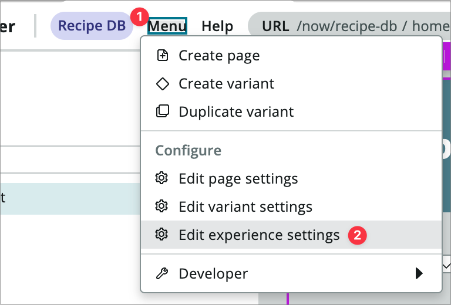

1. Click on **Branding and Theming** and the click **Advanced settings**. This will open in a new tab.

	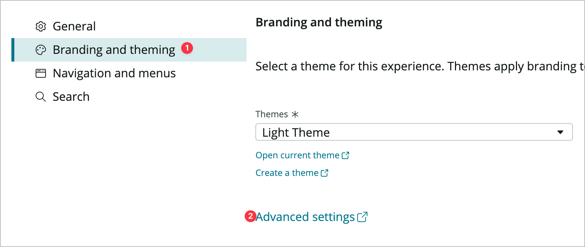

1. This should open the *UX App Configuration* record for the experience. You should see about 8 fields on the form. Find the *Landing Path* field and change it from the default *landing* to **home**. Right-click on the header (or use the hamburger icon at the far left of the ehader) and choose **Save**.

	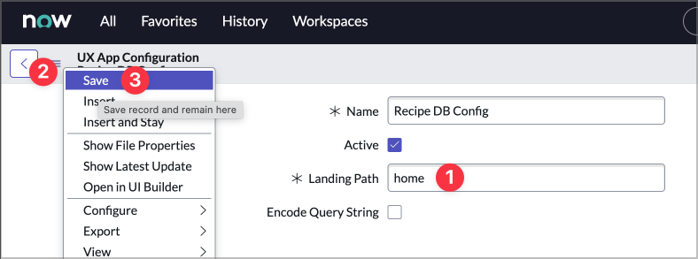

2. Now close the *UX App Configuration - Recipe DB Config* browser tab and return to UI Builder.

3. Back on the *Recipe DB settings* page on the *Branding and theming* tab from step 1, click **Open current theme**.

	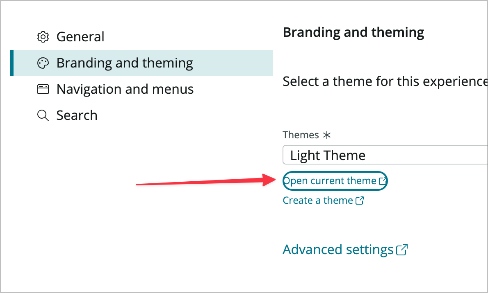

1. This will open the theme record in a new tab. Change the *Name* field from *Light Theme* to **Recipe Theme** and **Save** the record.

1. Now you'll replace the logo. First [download the logo file](images/RecipeDBLogo.png).

1. Now, click on the **Legacy: Experience Theme** tab, then mouse over the *now-logo-dark* UX Theme Asset, then click the little preview icon to the left, and then click the **Open Record** button on the popup.

	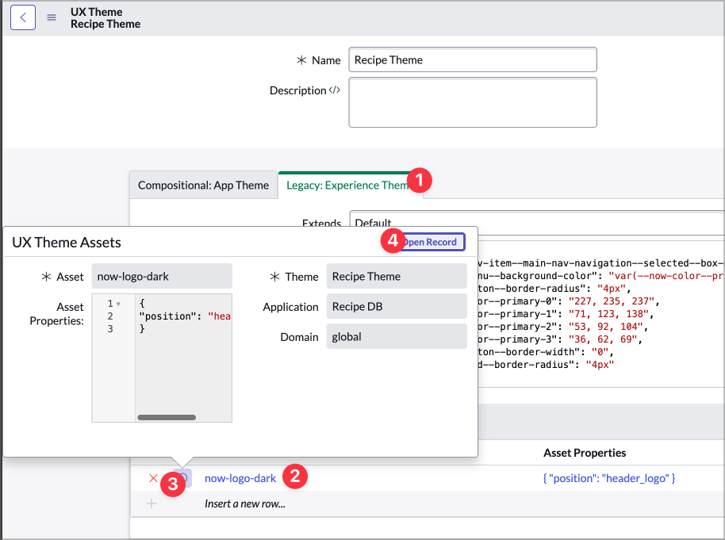

1. On the UX Theme Assets record, click the magnifying glass next to the *Asset* input. This will open the UX Theme Assets list.

	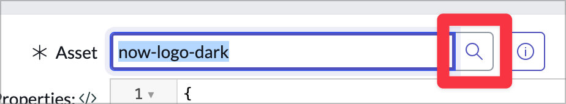

1. Create a new theme asset by click the **New** button at the top right of the browser tab.

1. Fill out the form by entering **recipe-logo** in the *Name* field, then click the attachments icon at the top right and attach the RecipeDBLogo.png image you downloaded.

	

1. Close out of the attachment modal and click **Submit**.

1. Now click **Update** on the UX Theme Assets record.

1. Now you'll update the theme. If the theme field is empty you may be experiencing a known issue with this form, go ahead and click into the theme field, and then use the header icon or right click and choose **Reload Form**. That should make the existing styles show up.

	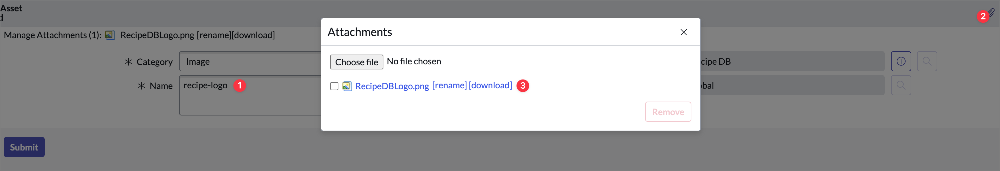

	You'll see something that may look slightly familiar if you know CSS, except the properties will look different. In UI Builder we're using [CSS custom properties](https://docs.servicenow.com/en-US/bundle/sandiego-application-development/page/administer/ui-builder/concept/work-themes.html) (or theming hooks) to apply CSS. 

1. Now paste the following code into the the theme field:

	```json
   {
       "--now-form-field--scale-size-block": "2",
       "--now-color--primary-0": "134,237,120",
       "--now-button--bare_secondary--color": "134,237,120",
       "--now-color--primary-1": "03,45,66",
       "--now-button--primary--background-color": "03,45,66",
       "--now-color--neutral-3": "219,219,219"
   }
	```

	Notice that some of these CSS custom properties match some of what you've set in the lab so far.

1. Click update on the UX Theme record and **Update** the record.

1. Now let's see how the page looks. Go ahead and close out of the *Recipe DB settings* using the **X** icon or **Cancel** button, and then using the **Open** link to preview the new theme in the runtime. You should notice a new logo and color scheme. If you still see the old logo it may be stored in your browser's cache. You can do a hard refresh with CMD+SHIFT+R on a mac or CTRL+SHIFT+R on windows.

## Header Properties

Now that you've themed the portal you need to take care of some of the header settings for your experience. You'll hide the search box, change the page that loads when the logo is clicked, and change the endpoint for the *Report issue* button.

1. First, go ahead and refresh your browser with AES/UIB so you get the new theme colors in UIB. 

1. From within UI Builder near the top of the UIB window, go to **Menu > Edit experience settings**.

1. In the *General* tab, click **Advanced settings**. This should open the UX Application record in a new browser tab.

2. Scroll down the the *UX Page Properties* related list and click on the **chrome_header** link with the corresponding Required Translations field that starts with [{"message":"Logout"...

	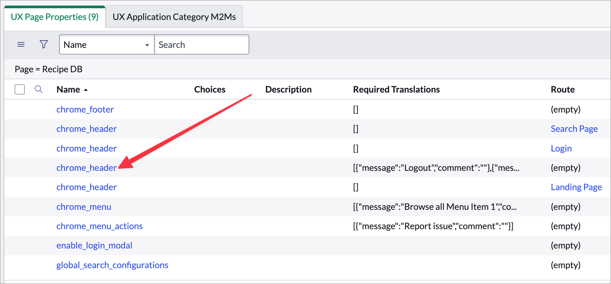

1. Paste the following into the *Value* field:

	```json
	{
		"privatePage": {
			"searchEnabled": false,
			"userPrefsEnabled": true,
			"currentScreenLinkConfiguration": {
				"roles": [
					"admin"
				],
				"position": 250
			},
			"globalTools": {
				"collapsingMenuId": 0,
				"primaryItems": [
					{
						"label": "UserMenu",
						"icon": "user",
						"type": "menu",
						"primaryDisplay": "icon",
						"value": {
							"children": [
								{
									"label": {
										"translatable": true,
										"message": "Settings"
									},
									"position": 100,
									"type": "navigation",
									"value": {
										"type": "route",
										"value": {
											"route": "settings",
											"fields": {}
										}
									}
								},
								{
									"label": {
										"translatable": true,
										"message": "Logout"
									},
									"position": 500,
									"type": "navigation",
									"value": {
										"type": "AUTH_ROUTE_BINDING",
										"binding": {
											"address": [
												"logout"
											],
											"params": {
												"reload": true
											},
											"default": "/logout.do"
										}
									}
								}
							]
						}
					}
				],
				"secondaryItems": []
			}
		},
		"publicPage": {
			"menuEnabled": true,
			"logoRoute": {
				"type": "route",
				"value": {
					"route": "home",
					"fields": {}
				}
			},
			"searchEnabled": false
		}
	}
	```

	This will have hidden the search box and changed the logo link. Feel free to test in the runtime to see changes.

1. Next, open the **chrome_menu_actions** UX Page Property and replace the *Value* field with the following:

	```json
	{
		"label": {
			"translatable": true,
			"message": "New Recipe"
		},
		"value": {
			"route": "catalog",
			"fields": {
				"sysId": "4d71937d1b3ec5500ef897941a4bcbcc"
			}
		}
	}
	```

	This will change the report issue button to a New Recipe button and point it to the Record Producer (using the sysId property) that creates a new recipe.

1. Click **Update**. 

1. Lastly, we'll change the menu structure. Open the **chrome_menu** UX Page Property and paste the following JSON into the *Value* field:

	```json
	[
		{
			"value": {
				"label": {
					"translatable": true,
					"message": "Home"
				},
				"target": "",
				"type": "route",
				"value": {
					"route": "home"
				}
			}
		},
		{
			"value": {
				"label": {
					"translatable": true,
					"message": "Recipe Tools"
				}
			},
			"children": {
				"items": [
					{
						"value": {
							"label": {
								"translatable": true,
								"message": "Food.com Measurement Converter"
							},
							"type": "external",
							"rightIcon": "open-link-fill",
							"value": {
								"href": "https://www.food.com/library/units-converter"
							}
						}
					},
					{
						"value": {
							"label": {
								"translatable": true,
								"message": "NY Times Cooking Substitutes"
							},
							"type": "external",
							"rightIcon": "open-link-fill",
							"value": {
								"href": "https://cooking.nytimes.com/guides/79-substitutions-for-cooking"
							}
						}
					},
					{
						"value": {
							"label": {
								"translatable": true,
								"message": "Baking Conversion Chart"
							},
							"type": "external",
							"rightIcon": "open-link-fill",
							"value": {
								"href": "https://www.kingarthurbaking.com/learn/ingredient-weight-chart"
							}
						}
					},
					{
						"value": {
							"label": {
								"translatable": true,
								"message": "Cake Pan Converter"
							},
							"type": "external",
							"rightIcon": "open-link-fill",
							"value": {
								"href": "https://www.bakinglikeachef.com/cake-pan-converter/"
							}
						}
					}
				]
			}
		},
		{
			"value": {
				"label": {
					"translatable": true,
					"message": "Recipe Sites"
				}
			},
			"children": {
				"action": {
					"label": {
						"translatable": true,
						"message": "New Recipe"
					},
					"type": "route",
					"value": {
						"route": "catalog",
						"fields": {
							"sysId": "4d71937d1b3ec5500ef897941a4bcbcc"
						}
					}
				},
				"items": [
					{
						"value": {
							"label": {
								"translatable": true,
								"message": "Brad's favorites"
							}
						},
						"children": {
							"action": {},
							"items": [
								{
									"value": {
										"label": {
											"translatable": true,
											"message": "Grilling and BBQ"
										}
									},
									"children": {
										"action": {},
										"items": [
											{
												"value": {
													"label": {
														"translatable": true,
														"message": "AmazingRibs"
													},
													"type": "external",
													"rightIcon": "open-link-fill",
													"value": {
														"href": "https://amazingribs.com/"
													}
												}
											},
											{
												"value": {
													"label": {
														"translatable": true,
														"message": "HowToBBQRight"
													},
													"type": "external",
													"rightIcon": "open-link-fill",
													"value": {
														"href": "https://howtobbqright.com/"
													}
												}
											},
											{
												"value": {
													"label": {
														"translatable": true,
														"message": "Vindulge"
													},
													"type": "external",
													"rightIcon": "open-link-fill",
													"value": {
														"href": "https://vindulge.com/"
													}
												}
											}
										]
									}
								},
								{
									"value": {
										"label": {
											"translatable": true,
											"message": "Other"
										}
									},
									"children": {
										"action": {},
										"items": [
											{
												"value": {
													"label": {
														"translatable": true,
														"message": "Americas Test Kitchen"
													},
													"type": "external",
													"rightIcon": "open-link-fill",
													"value": {
														"href": "americastestkitchen.com/recipes"
													}
												}
											},
											{
												"value": {
													"label": {
														"translatable": true,
														"message": "Dinner at the Zoo"
													},
													"type": "external",
													"rightIcon": "open-link-fill",
													"value": {
														"href": "https://www.dinneratthezoo.com/"
													}
												}
											}
										]
									}
								}
							]
						}
					},
					{
						"value": {
							"label": {
								"translatable": true,
								"message": "SNDevs Favorites"
							}
						},
						"children": {
							"action": {},
							"items": [
								{
									"value": {
										"label": {
											"translatable": true,
											"message": "SNDevs Favorites"
										}
									},
									"children": {
										"action": {},
										"items": [
											{
												"value": {
													"label": {
														"translatable": true,
														"message": "Serious Eats"
													},
													"type": "external",
													"rightIcon": "open-link-fill",
													"value": {
														"href": "https://www.seriouseats.com/"
													}
												}
											},
											{
												"value": {
													"label": {
														"translatable": true,
														"message": "Smitten Kitchen"
													},
													"type": "external",
													"rightIcon": "open-link-fill",
													"value": {
														"href": "https://smittenkitchen.com/"
													}
												}
											}
										]
									}
								}
							]
						}
					}
				]
			}
		}
	]
	```

	It's a lot of JSON, but that will recreate the menuing with the structure we want for the portal.

1. Click **Update** and then close the tab. Go back and test the page in the runtime. Click through the menus and buttons and see what's changed.

# Exercise 4 – Enhance the Home Page

## Goal

In this exercise you will add a typeahead search field to the homepage. There are a few different ways to add search to your experience, but in this lab you'll use the typeahead search component.

## Add a client state parameter

1. Make sure you've got the *Home* page opened in UI Builder. Click on the *Client State Parameters* icon to open the CSP panel.

	

1. Use the **+Add** button to to create a new client state parameter as follows:

	* *Name*: **searchFilter**
	* *Type*: **String**
	* *Initial value*: \<Leave empty\>

## Add a Data Resource

1. Use the *Data resource icon to open the *Data resource instances panel.

1. Use the **+Add** button to add a new data resource.

1. Search for and add the **Look Up Records** data resource.

1. Rename it to:

	* *Data broker Label*: **Look Up Recipes**
	* *Data broker ID*: **look_up_recipes**

	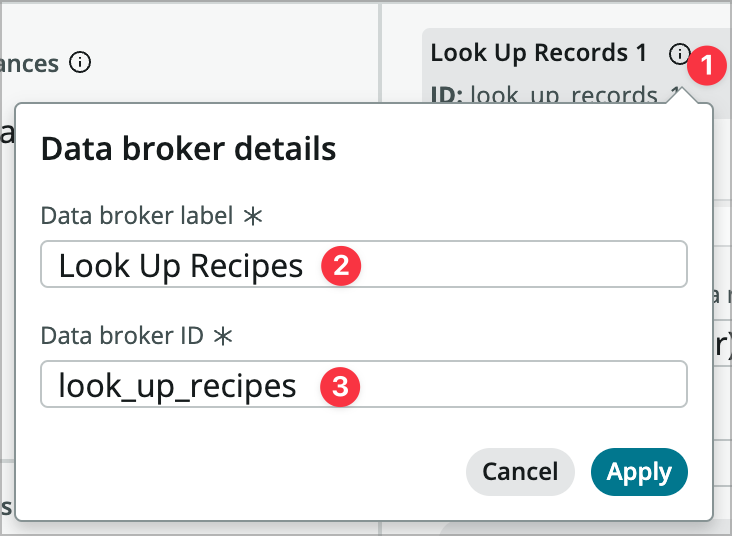

1. Fill out the data resource properties as follows:

	* *When to evaluate this data resource*: **Only when invoked (explicit**
	* *Table*: **Recipe [x_snc_recipe_db_recipe]**
	* *Edit conditions*: **[Name] [contains]** \<switch to dynamic data binding\> **[@state.searchFilter]**
		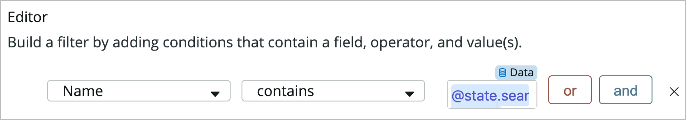
	* *Return fields*: **\[Name\] \[Category\] \[Image\] \[Sys ID\]**
	* *Order by*: **Name**

1. Close the date resource panel and **Save** the page.

## Add the Typeahead Search Component

At this point you have a data resource that filters the name based on the value in the searchFilter client state parameter. We just need to set that parameter and then bind the results of the search to the dropdown.

1. In the content panel, find the *Stylized text 1* component in *Row 1* and add a **Typeahead** component after the stylized text.

	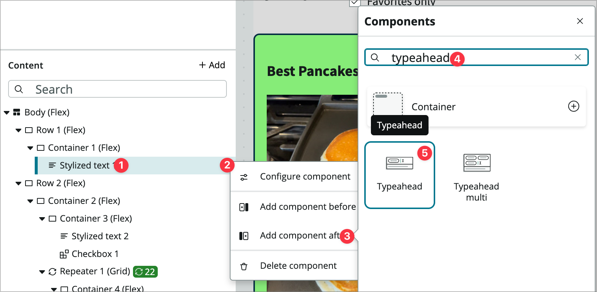

1. Configure its properties as follows:

	* *Label*: **\<clear out the label\>**
	* *Placeholder text*: **Search Recipes**

1. You're going to script the *Items* property, so mouseover that property and use the **\<\/\>** icon (next to dynamic data binding) to open the *Edit scripted property value* modal.

1. Paste the following script into the modal. This will convert the data returned by the data resource into an array with a format that the property is expecting.

	```javascript
	function evaluateProperty({api}) {
		const data = api.data.look_up_recipes.results;
		return data.map(e => ({
			id: e.sys_id.value,
			label: e.name.value,
			sublabel: e.category.displayValue,
			avatarProps: {
				userName: e.name.value,
				imageSrc: e.image.displayValue
			}
		}));
	}
	```

1. Click **Apply**

1. Now click into the *Styles* tab for the Typeahead component and set the *Background* property to **Neutral 1**.

1. Lastly, you'll need to add some event handlers so click on the *Events* tab.

1. Add a new event handler to the *Typahead value set* event and choose **Update client state parameter** under *Page-level event handlers* and configure it:

	* *Client State Parameter Name*: **searchFilter**
	* *New Value*: **\<switch to dynamic\> @payload.value**

	

2. Click **Add**.

3. Now add another event handler under that one to **Refresh** the Look Up Recipes data resource and click **Add**.

	

4. You still need to configure what happens when someone chooses something from the dropdown, but go ahead and **Save** the page and test it in runtime.

	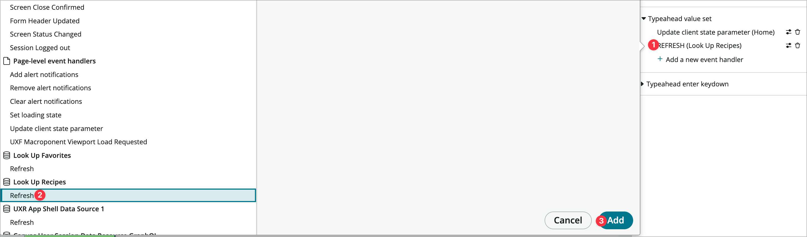

1. Now you need to open that recipe when it is clicked. Go back into UI Builder and add an event handler to the *Typeahead selected item set* event and choose **Link to destination**.

1. Use the **Select destination** button to open the configure navigation modal.

2. Choose the **Recipe** *App route*, change *recipeId* to dynamic data binding and enter **@payload.item.id**.

1. Click **OK** and then **Apply**.

1. **Save** the page again and test it in the runtime. When you search for and click on a recipe it should take you to that recipe.

# Exercise 5 – Enhance the Recipe Page

## Goal

In this exercise you will add a go to recipe button and favoriting to the recipe page.

## Add a Go to Recipe Button

1. Switch from the homepage to the recipe page.

	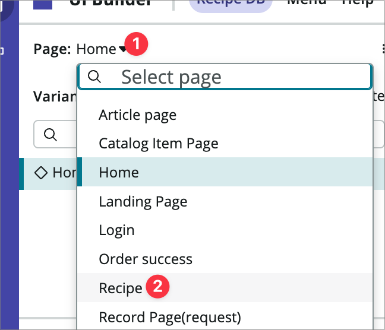

2. The first thing you need to do is change *Container 1* (inside Row 1) to flex items in a row rather than a column. Click **Container 1** in the content tree and in its *Styles* tab, change direction from *Column* to **Row**. Also set the *Align items* property to center vertically.

	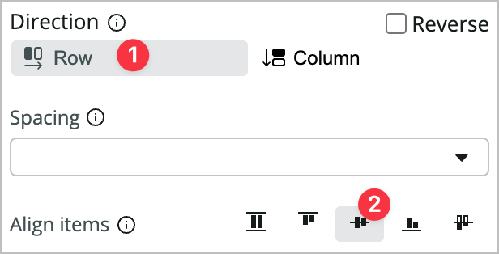

3. Now add a **Button** component after the *Stylized text 1* component in *Row 1*.

	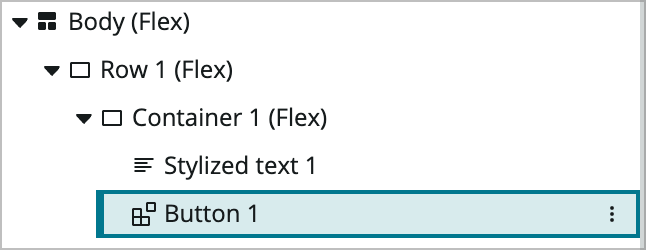

4. First, you're going to set the visibitlity on the button. Not all recipes have an external url and this button should only show up for those that do. In the configuration panel to the right of *Button 1* click the eye icon.

	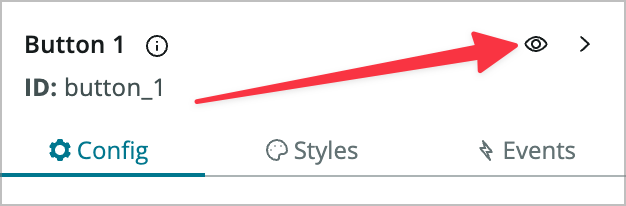

5. In the *Hide component* property that comes up (notice it's already set to dynamic data binding) enter **EMPTY(@data.look_up_recipe.result.url.value)**. This is a [formula](https://docs.servicenow.com/en-US/bundle/sandiego-release-notes/page/administer/ui-builder/reference/uib_supported_functions.html) (introduced in the San Diego release) that tests whether the value is empty and returns a true instead of false. If it's empty it returns true and the button is hidden.

6. Set other properties as follows:

	* *Label*: **Go to Recipe**
	* *Icon*: **Arrow Up Right Fill**

1. In the button's *Styles* tab, set its *Padding* to **Lg (1rem)**.

1. Now click into the *Events* tab and add an event handler to the *Button clicked* event.

1. Choose **Link to Destination** and click **Select Destination**.

1. In the modal, choose **External URL** and dynamically bind **@data.look_up_recipe.result.url.value** to *External URL*.

1. Click **OK** and **Add**.

1. **Save** the page and test it. Find a the *Mom's Pork Tenderloin* recipe and make sure the button doesn't show up for that and that your condition is working.

## Add favorites

Now that the open recipe button works, you'll add favoriting.

1. Open the data resources panel and add an **Update Record** new data resource.

	

2. Rename it to **Update Recipe** and then close the data resources panel.

	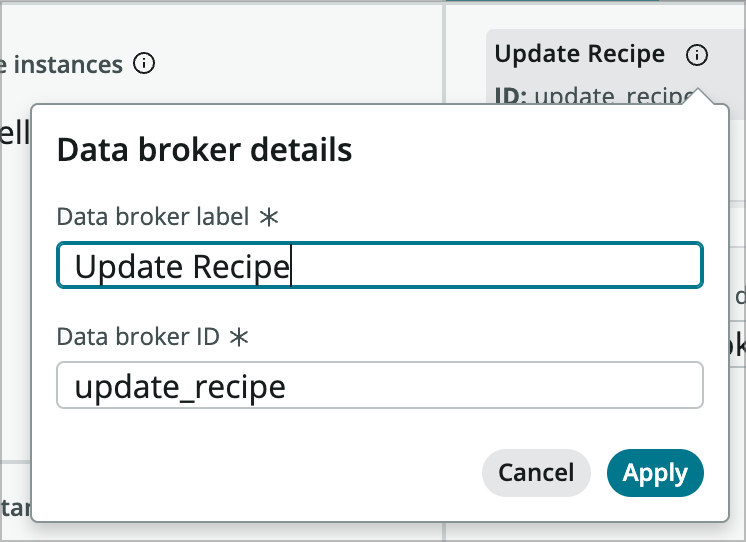

3. Add a **Button iconic** component before the *Go to Recipe* button you added.

4. Use the eye icon again to set the new button's visibility to hide the component using **IF(@data.look_up_recipe.result.favorite.value, true, false)**.

5. Set its properties:

	* *Icon*: **Heart Outline**
	* *Size*: **Large**
	* *Padding*: **Show**
	* *Tooltip text*: **Mark as favorite**

1. Add an event handler to the button iconic's event.

1. Choose **Execute** under *Update Recipe* and configure the form:

	* *Table*: **Recipe**
	* *Record*: \<dynamic data binding\> **@context.props.recipeId**
	* *Edit field values*: **[Favorite] [is] [true]**

1. Click **Apply** and then **Add**.

1. Add another event under that one to refresh the *Look Up Recipe* data resource.

	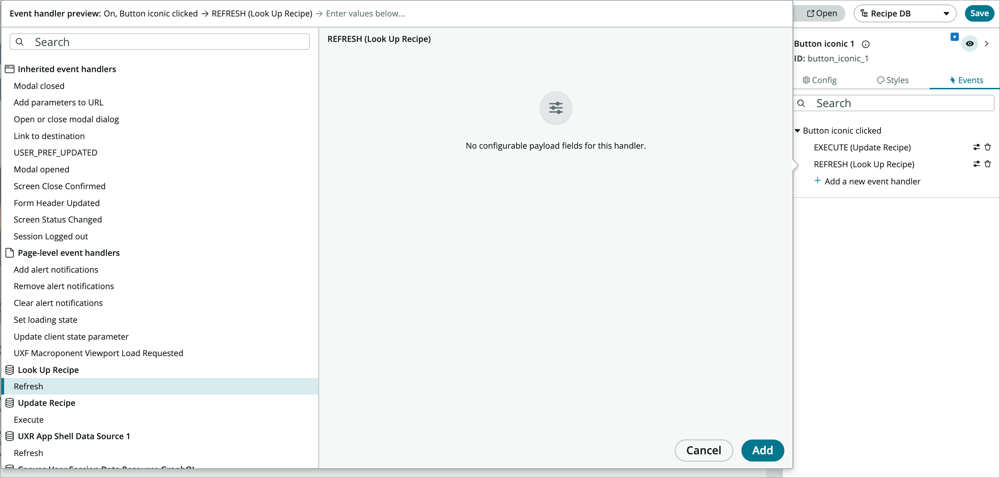

	This will set the favorite field on the recipe record to true when it is clicked and then refresh the data resource on the page so the visiblity changes on the button.

3. Now add another **Button iconic** component after the last one. This one will show when the recipe is already a favorite.

4. Set its visibility to hide the component using **IF(!@data.look_up_recipe.result.favorite.value, true, false)**.

5. Set its properties:

	* *Icon*: **Heart Fill**
	* *Size*: **Large**
	* *Padding*: **Show**
	* *Tooltip text*: **Unmark as favorite**

1. Add an event handler to the button's event.

1. Choose **Execute** under *Update Recipe* and configure the form:

	* *Table*: **Recipe**
	* *Record*: \<dynamic data binding\> **@context.props.recipeId**
	* *Edit field values*: **[Favorite] [is] [false]**

1. Click **Apply** and then **Add**.

1. Add another event under that one to refresh the *Look Up Recipe* data resource.

1. **Save** the page and test it. Try marking and unmarking some favorites. Is it reflected on what shows up on the homepage?

# Conclusion

I hope you learned a little something about UI Builder and how it can be used to create small, targeted, custom portal experiences for custom applications.

You learned how to use UI Builder to open a starter portal experience created from App Engine Studio to build a front-end to make it easier to interact with the application. You touched a number of different parts of UI Builder while you created the custom experience including, but not limited to:

* Creating new pages
* Page parameters
* Data resources
* Client state parameters
* Client scripts
* Configuring components
* Using the new repeater component
* Using the new formular editor
* Updating ServiceNow records from the experience
* Theming and branding
* Building custom menus

For more information on UI Builder and the Next Experience UI Framework visit out [Next Experience COE](https://nxtxp.link/coe) and don't hesitate to reach out on [LinkedIn](https://nxtxp.link/brad) or [SNDevs slack](https://sndevs.com) (@btilton).

# Challenge Exercises

## Goal

There are a couple of challenge exercises associated with this lab. They will not be as step by step as the entire lab (hence the challenge), but there is a completed version of the app available.

## Challenge 1 - Add an edit recipe page

There already exists a record page template you can use. Create a new page using the **Record** *Page template* and select the *Copy template contents (fully customizable)* radio button. This will let you customize the new page when it's created. You'll also need to create a couple of page parameters called **table** and **sysId** that take the table name of the recipe table and the sys_id of the recipe record being shown.

## Super Challenge 2 - Add Notes to the Recipe Page

There is a journal field on the recipe record called Notes. UI Builder doesn't support journal fields very well at the moment so you'll need to create a transform data resource that pulls journal entries that can be displayed on the page. The [UI Builder - Data Resources](https://developer.servicenow.com/blog.do?p=/post/quebec-ui-builder-data-resources) blog post may be helpful to use as a reference.

# Appendix

## Setting up your PDI for this lab

To learn how to request, access, and manage your Personal Developer Instance, check out [this Guide](https://developer.servicenow.com/dev.do#!/guides/sandiego/developer-program/pdi-guide/personal-developer-instance-guide-introduction).

1. Download and install the app from this Update Set:
    * [RecipeDB_BaseAppDatav1.2.xml](files/RecipeDB_BaseAppDatav1.2.xml)

2. Follow Steps 2a-e in this [Share Guide](https://developer.servicenow.com/dev.do#!/guides/quebec/developer-program/share-guide/share-guide-introduction#downloading-and-installing-a-project) to learn how to import and install an Update Set.

## Finished App

You can find an update set with this lab complete through the likes section of the challenge exercise at [RecipeDB_CompletedAppv1.0](files/RecipeDB_CompletedAppv1.0.xml).

## Github Info

You can also find the base application, completed exercises, and the completed app at this github repo: [https://github.com/ServiceNowNextExperience/killer-experience-lab-22](https://github.com/ServiceNowNextExperience/killer-experience-lab-22). You can fork the repo and import the app into your instance. This [Github Guide](https://developer.servicenow.com/dev.do#!/guides/sandiego/developer-program/github-guide/github-and-the-developer-site-training-guide-introduction) may be useful if you're not familiar with this process. This is an alternative to using update sets.